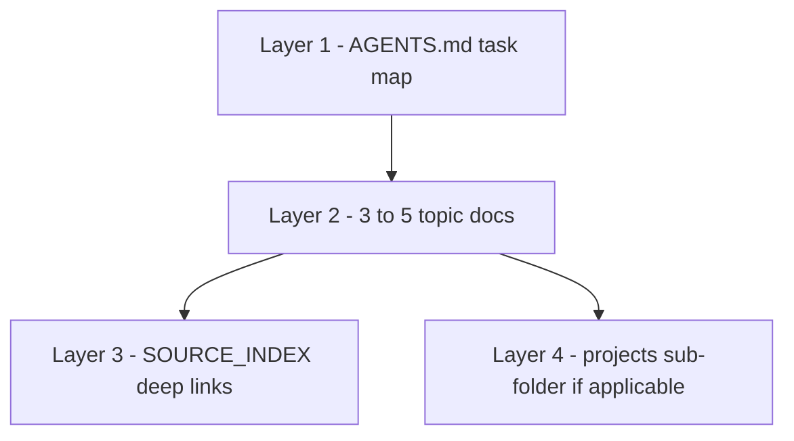

# Context engineering for design work

**Purpose:** How to load [`design-knowledge/`](README.md) efficiently in Cursor — right information, right time, minimal token waste.

**Companion:** [`AGENTS.md`](AGENTS.md) · [`../ai-engineering/context-engineering.md`](../ai-engineering/context-engineering.md)

**Harvest / review:** 2026-05

---

## Principles

| Principle | Practice |
|-----------|----------|
| **Task-first loading** | Pick docs from `AGENTS.md` tables — not the whole tree |
| **Separate global vs project** | `design-knowledge/` = any project; `projects/<name>/` = one vertical only |
| **Summarize, then link** | Our docs hold patterns; `SOURCE_INDEX.md` holds authorities |
| **Accessibility is non-optional** | Include `ui-design/accessibility.md` for any public web UI |
| **Refresh on ship** | After major UI ship, note what docs were wrong/missing in `session-log.md` |

---

## Context layers



| Layer | What | When |
|-------|------|------|
| 1 | `AGENTS.md` | Start of every design session |
| 2 | Topic docs (principles, a11y, e-commerce, etc.) | Implementation + review |
| 3 | External URLs from `SOURCE_INDEX.md` | Disputes, audits, “what does WCAG say?” |
| 4 | `projects/*` | Only for named sub-projects |

---

## Suggested prompt prefix (copy into project rules)

```text
Before UI or API design changes, read design-knowledge/AGENTS.md and load the task-matched docs listed there. Apply ui-design/accessibility.md for public web. Do not load projects/ unless this session is for that sub-project.
```

---

## Chunking for long builds

| Phase | Load |
|-------|------|
| Discovery / IA | `website-design/information-architecture.md`, `design-thinking/human-centered-process.md` |
| Visual / components | `ui-design/principles.md`, `ui-design/design-systems.md` |
| Build static pages | `design-patterns/static-site-patterns.md`, `ui-design/accessibility.md` |
| Checkout / donate | `e-commerce/checkout-and-payments.md` or `e-commerce/donations-nonprofit.md` |
| API layer | `backend-design/api-design-rest.md`, `full-stack/contract-first.md` |
| Pre-launch QA | `design-thinking/ux-research-methods.md`, `ui-design/accessibility.md` |

Unload prior phase docs from active context when switching phases if the window is tight.

---

## Agent hint

When the user says “design knowledge” or “use our design KB,” resolve to this folder — not equine `projects/` unless they name that project.
